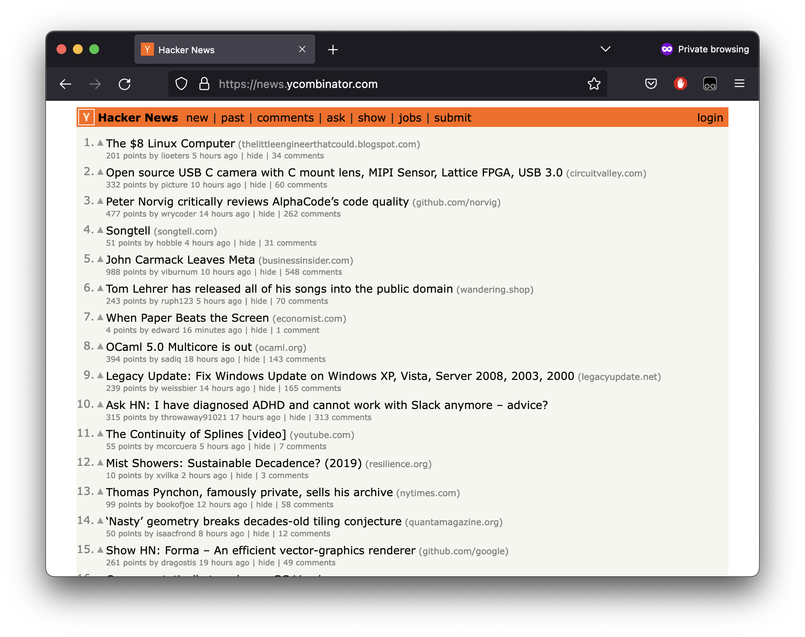
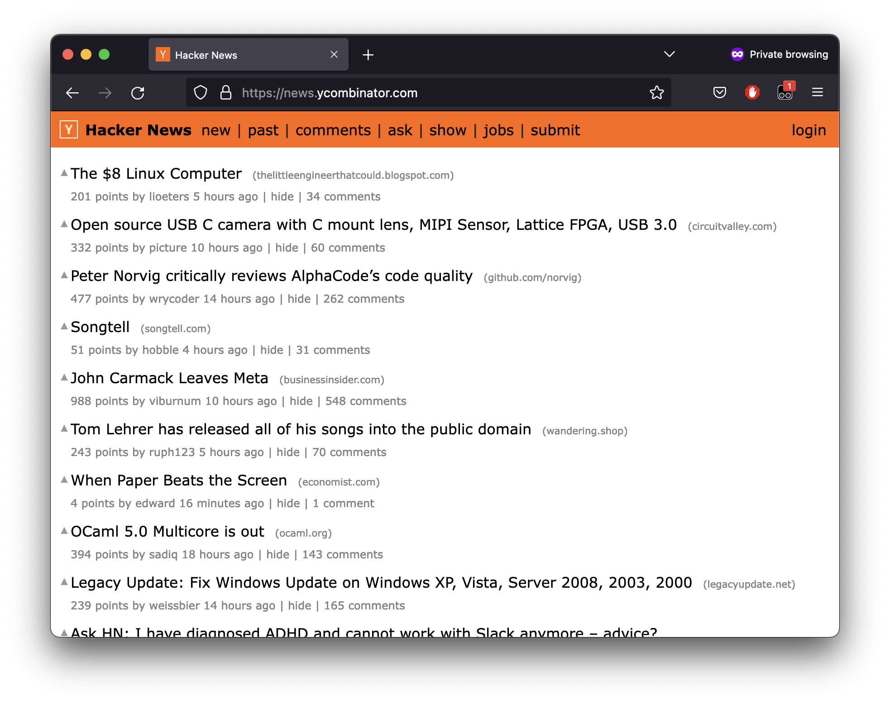
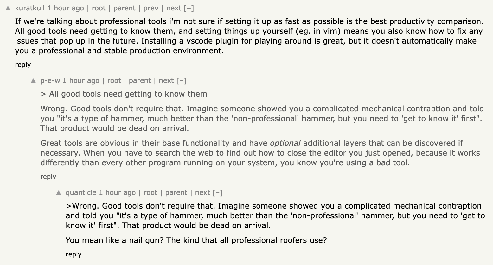
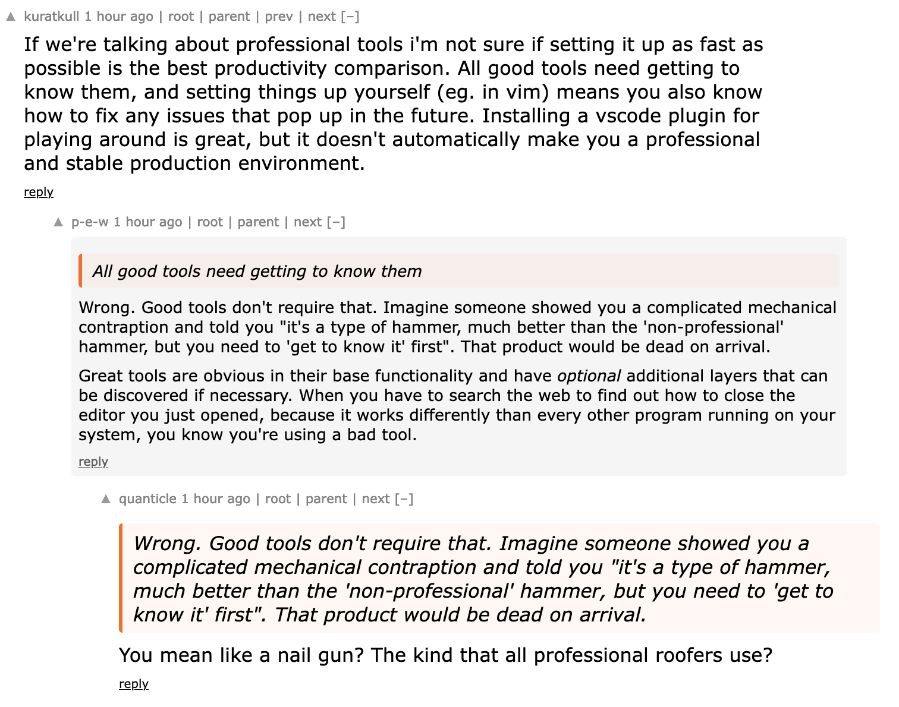

# news.ycombinator.com

A Tampermonkey script to make reading Hacker News more bearable.

This isn't an attempt to make Hacker News into something it isn't, or even fix up the html to make it accessible or play nicely with reader mode. 
It's just a tweak of the exising site, trying to keep the feel as close to the original as possible whilst fixing the biggest annoyances that make it hard to use and read. 

## Features

* Larger fonts so its legible at standard zoom level
* Menu bar is full width
* Some unnecessary cruft hidden (e.g. numbers next to headings on the homepage)
* downvoted comments no longer light gray text and hard to read. Instead:
  * black text
  * faint grey background
  * smaller font size
* some custom rending of formatting conventions
  * Leading `>` treated as a quote:
    * text node wrapped in a `
`
    * hn orange left border
    * faint orange background
    * italicised text

## 'normal' Hacker News homepage

## With this userscript enabled:

## 'normal' comments page

## Comments with this script enabled

# How to install

1. Install https://www.tampermonkey.net/
2. Select 'create a new script' from tampermonkey's plugin
3. Paste the raw contents of [tampermonkey.js](https://raw.githubusercontent.com/mgladdish/website-customisations/main/news.ycombinator.com/tampermonkey.js) into the editor
4. Save.
5. Open https://news.ycombinator.com in your browser and it should look much better!

## Gotchas

Running tampermonkey scripts without the browser plugin forces a couple of changes on how we write the script.
1. We can't use tampermonkey's built-in functions, e.g. any of the `GM_` functions.
2. As we're adding the script to our page after it has loaded, we need a way of triggering it to run. Therefore I've had to pull the script out into a referencable member. When the page loads there's a call to the function, and in the tests we can explicitly call the same function after we've attached it to the dom for it to take effect.